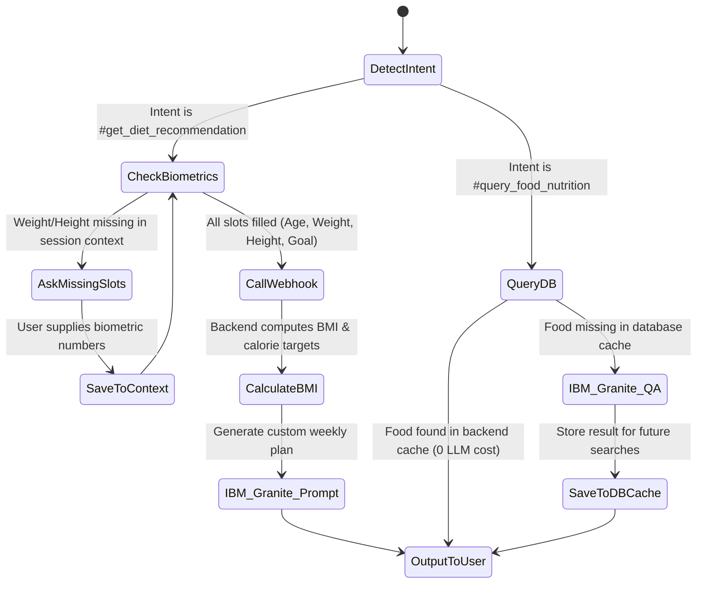

# IBM Watson & Granite AI Nutrition Chatbot: Architectural Specification
*Document Version: 1.0.0 | Role: AI Product Architect*

This document defines the production design for integrating **IBM Watson Assistant** (dialogue orchestrator and slot-filling router) and **IBM Granite** (large language model for generative coaching) to build the conversational engine of the AI Nutrition Assistant.

---

## 1. Intent & Entity Structures (IBM Watson Assistant)

By using Watson Assistant's intent parser rather than invoking the LLM for routing, we conserve tokens and protect our IBM Cloud Trial allowances.

### Intent Structure
| Intent Name | Example User Utterances | Description |
| :--- | :--- | :--- |
| `#get_diet_recommendation` | "What should I eat to lose weight?", "Give me a keto diet plan" | Triggers the meal recommendation engine. |
| `#query_food_nutrition` | "How many calories in paneer?", "Is avocado high in protein?" | Queries macro details for specific foods. |
| `#explain_bmi` | "What does my BMI mean?", "Is a BMI of 26 bad?" | Explains BMI classification and range metrics. |
| `#get_meal_suggestion` | "What can I eat for a high-protein snack?", "Healthy dinner options" | Recommends contextual meal choices. |
| `#track_goals` | "Am I close to my protein goal?", "Show daily calorie progress" | Summarizes current progress metrics. |
| `#get_health_insights` | "Why am I feeling tired on this low-carb diet?", "Health tips" | Asks for general nutrition advice. |

### Entity Structure
Watson Assistant extracts parameters from the conversational string using system and user-defined entities.

* **`@food_item` (Pattern / Synonyms)**:
  * Synonyms: *roti, rice, dal, paneer, egg, salad, chicken, salmon, oats, beef, yogurt*
* **`@meal_type` (Values list)**:
  * Synonyms: *breakfast, lunch, dinner, snack, post-workout*
* **`@health_goal` (Values list)**:
  * Synonyms: *weight_loss (cut, lose fat), weight_gain (bulk, build muscle), maintain (stay fit)*
* **`@dietary_preference` (Values list)**:
  * Synonyms: *veg (vegetarian, plant-based), non_veg (omnivore, meat-eater), vegan, keto, gluten-free*
* **`@sys-number` (IBM System Entity)**:
  * Extracts age, weight (kg), height (cm), and portions.

---

## 2. Conversation Flow & Slot Filling

Watson Assistant acts as the front-line agent, capturing necessary biometrics before executing backend queries or LLM lookups.



### Dialog Slot-Filling Details:
1. **Trigger**: Intent matches `#get_diet_recommendation`.
2. **Required Slots**:
   * Slot 1: `Age` (mapped to `$age` context variable)
   * Slot 2: `Weight` (mapped to `$weight` context variable)
   * Slot 3: `Height` (mapped to `$height` context variable)
   * Slot 4: `DietType` (mapped to `$dietType` context variable)
3. **Execution**: If a slot is missing, Watson prompts: *"To personalize your diet, could you tell me your [Missing Parameter]?"*. Once all variables are stored in context, Watson initiates the backend webhook.

---

## 3. Backend Integration Flow & Webhooks

Watson Assistant communicates with our Node.js Express server using JSON Webhooks.

```
+------------------------+             JSON Webhook             +-----------------------+
|  IBM Watson Assistant  |  --------------------------------->  |   Node.js Backend     |
|                        |  <---------------------------------  |   (Express Server)    |
+------------------------+       BMI & Calorie targets          +-----------------------+
                                                                            |
                                                                            | API Webhook
                                                                            v
+------------------------+        Personalized Advice           +-----------------------+
|       IBM Granite      |  <---------------------------------  |       Watsonx.ai      |
|    (IBM Cloud LLM)     |  --------------------------------->  |      Token Endpoint   |
+------------------------+                                      +-----------------------+
```

### Webhook JSON Payload Schema (Watson to Backend):
```json
{
  "user_id": "usr_998877",
  "intent": "get_diet_recommendation",
  "context": {
    "age": 28,
    "weight": 78,
    "height": 182,
    "goal": "weight_loss",
    "dietType": "non_veg"
  }
}
```

---

## 4. Prompt Templates (IBM Granite)

For generative recommendations and advice, the backend formats structured prompt templates sent to the `ibm/granite-13b-instruct-v2` model via the Watsonx.ai API.

### Prompt Template 1: Weekly Diet Generation
```
System Prompt:
You are an expert AI Nutritionist. Generate a highly structured, healthy daily meal plan (Breakfast, Lunch, Dinner) based on the user's biometrics, dietary preference, and weight goals. Output the plan in a clear, concise bulleted list. Keep explanations minimal to conserve tokens.

User Context:
- User Age: {age}
- User Weight: {weight} kg
- User Height: {height} cm
- Target Goal: {goal}
- Dietary Type: {dietType}
- Target Daily Caloric Limit: {recommendedCalories} kcal

Response:
```

### Prompt Template 2: Health Insights & Inquiries
```
System Prompt:
You are a health-tech assistant. Answer the user's health inquiry using scientifically backed nutritional guidance. If the query asks for clinical diagnosis, politely advice consulting a healthcare practitioner.

User Question:
{user_query}

Response:
```

---

## 5. Context Memory Design

To maintain conversational state across sessions without polluting the LLM's context window, we utilize a tiered memory design.

```
+---------------------------------------------------------------------------------------------------+
|  1. SESSION MEMORY (Watson Assistant Context)                                                     |
|  - Lifetime: Active Chat Session (deleted after 30 mins inactivity)                               |
|  - Variable Cache: $age, $weight, $height, $goal, $dietType, $currentCalorieIntake                |
+---------------------------------------------------------------------------------------------------+
                                                 |
                                                 v
+---------------------------------------------------------------------------------------------------+
|  2. PERSISTENT MEMORY (Express Server MongoDB)                                                    |
|  - Lifetime: Permanent User Profile                                                               |
|  - Schema Sync: Syncs session variables on chat start and settings updates                        |
+---------------------------------------------------------------------------------------------------+
                                                 |
                                                 v
+---------------------------------------------------------------------------------------------------+
|  3. LLM INFERENCE WINDOW (Watsonx API Call)                                                       |
|  - Lifetime: Stateless single call execution                                                      |
|  - Context Injection: Server retrieves MongoDB parameters and injects them as System prompts      |
+---------------------------------------------------------------------------------------------------+
```

---

## 6. IBM Cloud Trial Optimization Rules

To operate the Watson Assistant and Watsonx.ai Granite instances entirely within the **IBM Cloud Free Tier / Lite Account** allocations, we enforce the following rules:

1. **Intelligent Routing**:
   * Never invoke IBM Granite for basic logic or static lookup queries. Watson Assistant handles BMI arithmetic (`weight / (height/100)^2`) and returns the BMI category via simple logic branches (0 LLM cost).
2. **Caching Food Nutrition Queries**:
   * The backend check routes food searches to our local MongoDB food directory (e.g. roti, rice, paneer). Granite is only queried if the item is not found, saving Watsonx tokens.
3. **Truncate Conversation History**:
   * Do not pass long chat transcripts to Granite. Limit historical chat strings to the last **2 conversational turns** when asking Granite for follow-up advice.
4. **Granite Parameter Settings**:
   * Set the model configuration parameter `max_new_tokens` to `150` for recipes and `80` for brief questions to prevent runaway token charges.
