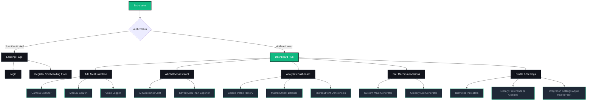

# AI Nutrition Assistant: Premium UI/UX Design Specification
*Document Version: 1.0.0 | Role: Senior UI/UX Designer*

This document outlines the complete design architecture, visual styling, page blueprints, and user experience paradigms for the **AI Nutrition Assistant**—a premium, dark-themed, mobile-responsive health-tech SaaS application tailored for students, fitness enthusiasts, and working professionals.

---

## 1. Information Architecture (IA)

The Information Architecture is designed to minimize cognitive load while presenting complex biographical, nutrient, and generative AI data. It follows a hub-and-spoke model centered on the user's daily dashboard.



---

## 2. User Journey Mapping

We map the journey of our three primary target personas to identify critical UX friction points.

### Persona 1: The Student (Budget & Time Constrained)
* **Goal**: Eat healthy, high-energy meals within a limited budget and study schedule.
* **Journey**:
  1. **Discovery**: Lands on Landing Page via mobile; reads value proposition: *"AI meal tracking in 3 seconds by taking a photo."*
  2. **Onboarding**: Signs up via Google Auth. Sets profile details: "Student, $150/month grocery budget, high cognitive performance focus."
  3. **Interaction**: Uses the **AI Chatbot** to ask: *"What are high-protein, brain-boosting meals I can make in a dorm microwave under $5?"*
  4. **Logging**: Snaps a photo of a microwave oatmeal bowl; the **Add Meal** AI scanner instantly logs 350 kcal, 12g protein.
  5. **Retention**: Receives a notification reminder: *"Keep your hydration up for your evening study session!"*

### Persona 2: The Fitness Enthusiast (Precision Trackers)
* **Goal**: Optimize body composition (muscle gain or fat loss) through exact macronutrient ratios.
* **Journey**:
  1. **Discovery**: Sees analytics highlights on Landing Page demonstrating precision macro tracking.
  2. **Onboarding**: Registers and enters granular metrics: Target body fat %, daily activity multiplier, custom protein targets (e.g., 2.0g per kg).
  3. **Dashboard Usage**: Views the dynamic **Dashboard** displaying circular rings for Protein, Carbs, and Fats.
  4. **Meal Intake**: Uses **Add Meal** manual entry to log custom meal preps.
  5. **Analytics**: Swipes to **Analytics** to view weekly calorie trends, macronutrient deviation percentages, and weight progression correlation.
  6. **Optimization**: Generates a custom high-protein meal template on **Diet Recommendations**.

### Persona 3: The Working Professional (Convenience & Habit Builders)
* **Goal**: Maintain healthy weight and energy stability despite eating restaurant lunches and busy meeting schedules.
* **Journey**:
  1. **Discovery**: Installs mobile web app directly to home screen via progressive web app (PWA) banner.
  2. **Onboarding**: Logs in using Magic Link. Integrates Apple Health to sync daily active calories.
  3. **Logging**: Speaks into the **Add Meal Voice Logger**: *"I had a salmon salad with vinaigrette dressing and an iced latte at a cafe."* AI processes the speech, identifies the ingredients, and logs it.
  4. **Actionable Feedback**: The AI observes a high fat intake at lunch and sends a push warning: *"High fat intake at lunch. Your recommended dinner is a lean chicken breast bowl with broccoli (low-fat, high-fiber) to stay in your target zone."*
  5. **Subscription**: Upgrades to Premium for automated grocery list delivery integration.

---

## 3. Navigation & Page Hierarchy

The app employs a layout structured to optimize thumb movement on mobile and screen space on desktop.

### Navigation Architecture
* **Global Header (Desktop / Tablet)**:
  * Left: Brand Logo & Workspace switcher.
  * Center: Global Command search bar (Cmd+K / Ctrl+K) to find foods, start chats, or jump pages.
  * Right: Hydration counter, Notification Bell icon (with active dot), Profile picture dropdown.
* **Persistent Sidebar (Desktop / Tablet - Collapsible)**:
  * Dashboard (Icon + Label)
  * Add Meal (Accent Action Button - Primary color)
  * Analytics (Icon + Label)
  * Diet Recommendation (Icon + Label)
  * AI Chatbot (Icon + Label)
  * Profile & Settings (Icon + Label - Positioned at bottom)
* **Persistent Bottom Nav (Mobile)**:
  * 5-button layout:
    1. **Home** (Dashboard)
    2. **Analytics**
    3. **Add Meal** (Floating Action Button - Centered, larger, contrasting color)
    4. **AI Chatbot**
    5. **Profile**

---

## 4. Typography & Color Palette (Premium Dark Theme)

### Color Palette (60-30-10 Rule)
A dark interface needs contrast control to avoid reading fatigue. We use deep blues/slate colors rather than pure black to create depth and softness.

| Type | Color Name | Hex Code | HSL Representation | Purpose / Application |
| :--- | :--- | :--- | :--- | :--- |
| **60% Base** | Obsidian Dark | `#090A0F` | `hsl(230, 20%, 5%)` | Global app background |
| **30% Surf** | Slate Surface | `#12141C` | `hsl(228, 15%, 9%)` | Cards, sidebars, modal containers |
| **Border** | Slate Border | `#1F2433` | `hsl(225, 24%, 16%)` | Section dividers, element borders |
| **10% Accent**| Bio-Green | `#10B981` | `hsl(150, 84%, 44%)` | Primary brand color, success states, calorie goals |
| **AI Accent** | Electric Teal | `#06B6D4` | `hsl(188, 86%, 43%)` | AI-generated content, chatbot features, hydration |
| **Warn/Alert**| Amber Glow | `#F59E0B` | `hsl(38, 92%, 50%)` | Warning states, high sodium, calorie surplus |
| **Text (Pri)**| Frost White | `#F3F4F6` | `hsl(220, 14%, 96%)` | Main headings, important body text |
| **Text (Sec)**| Slate Muted | `#9CA3AF` | `hsl(220, 9%, 62%)` | Labels, helper text, timestamps |

### Typography System
We use **Outfit** for headlines (gives a friendly, premium, geometric tech look) and **Inter** for data points and UI text (supreme legibility).

* **Display Title (Hero Banner)**: `Outfit` / Bold (700) / `36px` (Desktop) or `28px` (Mobile) / Line height `1.2`
* **H1 (Page Headers)**: `Outfit` / Semibold (600) / `28px` (Desktop) or `22px` (Mobile) / Line height `1.3`
* **H2 (Section/Card Headers)**: `Outfit` / Semibold (600) / `20px` / Line height `1.4`
* **Body Text (Primary)**: `Inter` / Regular (400) / `14px` / Line height `1.5`
* **Body Text (Bold)**: `Inter` / Medium (500) or Semibold (600) / `14px`
* **Label/Caption**: `Inter` / Medium (500) / `12px` / Line height `1.4`
* **Numerical Metrics (Macro percentages/Calorie readouts)**: `Outfit` / Bold (700) / `24px` to `32px` for visual weight.

---

## 5. Component Hierarchy (React/Vue Scaffold)

```
[App]
 ├── [GlobalContextProvider] (Auth, Meal Logging, AI recommendations states)
 ├── [Layout]
 │    ├── [SidebarNav] (Desktop)
 │    ├── [BottomNav] (Mobile)
 │    ├── [Header] (Search, Notification Center, Biometric Snapshot)
 │    └── [MainContentWrapper]
 └── [Pages]
      ├── [LandingPage]
      │    ├── [HeroSection] (AI Call-To-Action, visual mockup)
      │    ├── [FeatureGrid] (Slick micro-interactions highlighting AI tracking)
      │    └── [PricingCards] (Students vs Premium plans)
      ├── [Dashboard]
      │    ├── [MetricRingGrid] (Calorie gauge, Carbs/Protein/Fat secondary rings)
      │    ├── [HydrationTracker] (Fluid log slider + quick water cups UI)
      │    ├── [MealTimeline] (Timeline list of Breakfast, Lunch, Dinner, Snacks)
      │    │    └── [MealCard] (Image, calories, macros, AI analysis badge)
      │    └── [AIQuickAdvice] (Dynamic, contextual 1-sentence tip from the AI)
      ├── [AddMeal]
      │    ├── [ScannerCamera] (Realtime camera capture frame)
      │    ├── [VoiceRecorderButton] (Click-to-speak meal logging)
      │    ├── [ManualMealForm] (Autocomplete inputs, dynamic macro adjuster)
      │    └── [AIProcessingOverlay] (Lottie animation representing active AI scanning)
      ├── [Analytics]
      │    ├── [CalorieTrendChart] (Area chart - daily tracking vs goal)
      │    ├── [MacroSplitChart] (Stacked bar chart showing weekly distribution)
      │    └── [MicronutrientHeatmap] (Grid layout representing vitamin/mineral levels)
      ├── [DietRecommendation]
      │    ├── [GoalSelector] (Bulk, Cut, Recomp, Endurance)
      │    ├── [MealPlanCardList] (Carousels of chef-designed, AI-adapted meals)
      │    └── [GroceryListExporter] (Generate markdown list, download PDF button)
      └── [AIChatbot]
           ├── [ChatWindow] (Auto-scroll list of messages)
           │    └── [ChatMessage] (User vs Assistant styling, food item tags)
           └── [ChatInputArea] (Speech-to-text button, text input, custom prompt pills)
```

---

## 6. Page-by-Page Wireframe & UX Specs

### Page 1: Landing Page (Conversion Engine)
* **Layout**: Single-column vertical scroll. Sticky navigation with glassmorphism backdrop (`backdrop-filter: blur(12px)`).
* **Wireframe**:
  * **Hero Area**: Left: "Your Personal AI Nutritionist, in Your Pocket." Accent button: "Get Started Free" (Bio-Green background, pulse animation). Right: Beautiful device mockup showing the AI Scanner extracting macronutrients from an image.
  * **Feature Grid**: 3 Cards layout. Card 1: AI Instant Photo Scan. Card 2: Voice Log. Card 3: Personalized Diet Generation. Cards have dynamic hover effects: background changes to a dark green radial gradient with a glow border.
  * **Social Proof**: "Tracked by 50,000+ athletes, students, and professionals." Carousel of user testimonials.
* **UX Reasoning**: Health SaaS requires high trust. Showcasing actual interface screenshots and immediate pricing transparency ensures higher activation rates.

### Page 2 & 3: Login & Register (Seamless Friction-Free Entry)
* **Layout**: Split screen. Left: Beautiful high-quality image of healthy lifestyle/fresh food, overlayed with a glassmorphism testimonial card. Right: Simple dark container form.
* **Wireframe**:
  * Large Title: "Welcome Back" / "Create Your Account".
  * Social Sign-in Buttons: Google and Apple login buttons (clean grey border, brand icons).
  * Divider line: "Or continue with email".
  * Text fields: floating labels, clear focus states (Teal shadow).
  * Onboarding Questions (for Register): 3-step wizard. Step 1: Core Goal (Lose fat, Gain muscle, Live healthier). Step 2: Biometrics. Step 3: Diet preference (Vegan, Keto, Omnivore).
* **UX Reasoning**: Onboarding asks for a lot of data. Breaking it into small cards with a step indicator (Progress Bar at the top) prevents users from dropping off.

### Page 4: Main Dashboard (The Cognitive Control Center)
* **Layout**: 12-column grid system.
  * **Desktop**: Sidebar (col-2), Main Content (col-7), Assistant Sidebar widget (col-3).
  * **Mobile**: Full-screen single column with bottom nav.
* **Wireframe**:
  * **Row 1**: Caloric Balance Ring Card. Large ring showing `1,420 / 2,200 kcal` eaten. Next to it, three smaller horizontal progress rings: Protein (110g/150g), Carbs (140g/220g), Fat (45g/65g). Underneath: Hydration widget (slider representing water glasses).
  * **Row 2**: "Today's Meals" list. Cards showing breakfast, lunch, snack, dinner. Each card shows a photo preview, name, time, calorie count, and small circular progress icons representing macro split.
  * **Row 3**: "AI Assistant Snapshot" (Col-3 sidebar widget on desktop, row 3 on mobile). Shows a pulsing cyan icon with text: *"You are 20g short of your protein goal. I recommend having a cup of Greek Yogurt for your next snack."* Quick Action button: "Add Greek Yogurt" (automatically logs).
* **UX Reasoning**: The circular ring is the standard of health tracking. Placing macro rings in the same visual area allows users to check status in a single glance.

### Page 5: Add Meal (High-Speed Input Panel)
* **Layout**: Modal drawer sliding up from the bottom on mobile, full-screen overlay on desktop.
* **Wireframe**:
  * Header: "Log a Meal". Tab bar: **[1] AI Camera [2] Voice Log [3] Manual Search**.
  * **AI Camera Tab**: Active viewfinder window. Capture button centered. Gallery import button on left. Tips popup: *"Ensure food is well-lit and fully visible."*
  * **Voice Log Tab**: Pulsing microphone button in the center. Real-time speech-to-text transcript output container underneath: *"Listening: I ate two eggs and a slice of whole wheat toast..."*
  * **Manual Search Tab**: Search input bar at top. Autocomplete list matches food items in real-time. Double tap to add 1 serving.
  * **Final Review Step**: Once input is parsed, displays a card with food names, portions, calorie estimation, and "Save to Log" button.
* **UX Reasoning**: Manual logging is the #1 reason users stop tracking. By providing camera and voice scanning front-and-center, logging time is cut from 2 minutes to 5 seconds.

### Page 6: Profile & Onboarding Settings (Identity & Goal Tuning)
* **Layout**: Grid layout with sidebar sub-navigation.
* **Wireframe**:
  * Left: User Profile Summary (Profile photo upload, name, current plan badge, Quick Bio).
  * Right: Form tabs: General Settings, Diet Profile, Integrations, Notifications.
  * Diet Profile: Slider for target weight. Interactive selector for dietary allergies (gluten-free, peanut-free, lactose-free) and food restrictions.
  * Integrations: Toggle cards for Apple Health, Google Fit, Fitbit, and Garmin. When connected, cards transition to a Bio-Green border with "Active Sync" badge.
* **UX Reasoning**: Users frequently change diet objectives (e.g., bulking for winter, cutting for summer). Providing simple sliders and quick allergy tag pills makes target tuning straightforward.

### Page 7: Analytics (Long-term Health Intelligence)
* **Layout**: 12-column grid. Date range selector at the very top (7 Days, 30 Days, 3 Months, YTD).
* **Wireframe**:
  * **Row 1 (Col-8)**: Calorie Balance Chart (Smooth area graph: solid line for target calories, gradient-filled green area representing daily intake).
  * **Row 1 (Col-4)**: Calorie Consistency Score Card. Radial dial rating consistency out of 100%.
  * **Row 2 (Col-6)**: Macronutrient Correlation Chart. Stacked bar charts showing percentage distribution of Protein vs Carbs vs Fat over the selected time period.
  * **Row 2 (Col-6)**: Micronutrient Deficiency Grid. Grid of circular progress badges showing Vitamin D, Vitamin C, Iron, Zinc, Calcium levels, flagged with Amber Glow color if intake is deficient.
* **UX Reasoning**: Area charts help users notice patterns (e.g. overeating on weekends). Stacked bars make macro balance relative to total calories immediately obvious.

### Page 8: Diet Recommendation (Generative Kitchen)
* **Layout**: Split page. Left: Parameters panel (Calories goal, meal frequency, dietary type). Right: Weekly meal planner calendar.
* **Wireframe**:
  * Left: Goal selector dropdown, calorie slider, "Generate New Week Plan" button (Electric Teal gradient background).
  * Right: 7-day columns slider layout. Each day shows 3-4 meal slots.
  * Hovering over a recommended meal shows: Cooking time, ingredients count, difficulty level, and a "Regenerate" button to cycle that specific meal.
  * Footer: "Add All Ingredients to Shopping List" floating CTA.
* **UX Reasoning**: Instead of generic static plans, custom generation interactive slots make users feel the app is tailored specifically for their tastes.

### Page 9: AI Chatbot (Interactive Nutritionist)
* **Layout**: Split container. Left panel: Saved Meal Ideas & Recipes. Right panel: Main Chat Area.
* **Wireframe**:
  * **Main Chat Area**: Classic message thread. Chatbot messages have an Electric Teal outline badge: `AI Nutritionist`. User messages are aligned right with dark slate background.
  * Quick-prompt pills at the bottom (floating above input bar): *"Analyze my breakfast"* | *"Suggest high protein snack"* | *"Is peanut butter good for fat loss?"*.
  * Input area: Text input box with microphone icon and paperclip upload icon.
* **UX Reasoning**: Conversational UI can feel empty. Quick prompt pills prompt users with what to ask, increasing interactions with the AI feature.

---

## 7. UX & Accessibility (a11y) Design Patterns

To deliver a premium experience that supports all users, the design adheres to Web Content Accessibility Guidelines (WCAG 2.1 AA) and modern UX practices.

### Color Contrast & Typography Accessibility
* **Contrast Ratios**: All text elements maintain a minimum contrast ratio of `4.5:1` against the dark background. Frost White text is at least `7:1`. Slate Muted text is tested for `4.5:1` legibility (e.g. background `#12141C` against secondary text `#9CA3AF`).
* **Text Scaling**: Layout containers use relative units (`rem` / `em`) to allow text scaling up to 200% without breaking page elements.
* **Focus States**: High-contrast, custom outline indicators (using brand teal/green glow) highlight all input inputs, buttons, and links when navigated via keyboard.

### Responsive Web Design Layout Grid Specs
* **Breakpoints**:
  * Mobile: `< 640px` (Stacked layout, persistent bottom navigation, large tap targets: minimum `48px x 48px`).
  * Tablet: `640px - 1024px` (Collapsible sidebar menu, 2-column dashboard grid).
  * Desktop: `> 1024px` (Full 12-column grid, persistent sidebar, right-hand details pane).
* **Flexbox/Grid Rules**: CSS grid for page layouts, flexbox for inside-card distributions. Avoid fixed pixel widths; use percentage-based flex-grow variables.

### Accessibility Quick Wins & Interaction Details
1. **Screen Reader Tags**: All form fields feature explicit `<label>` tags. Camera viewfinder and uploaded images have programmatic `alt` tags generated by the AI image describer (e.g., `"Close-up of a chicken avocado salad bowl"`).
2. **Keyboard Navigation**: The AI chat input handles `Shift + Enter` for line breaks and `Enter` to submit. Keyboard command `Cmd+K` opens the quick action navigation command bar.
3. **No Tap Traps**: Modals are dismissible by tapping the outer overlay or hitting the `Esc` key.
4. **Micro-interactions**: Hovering on key metrics triggers tiny layout scale elevations (`scale(1.02)`) with CSS spring curves (`transition: transform 0.3s cubic-bezier(0.175, 0.885, 0.32, 1.275)`).
